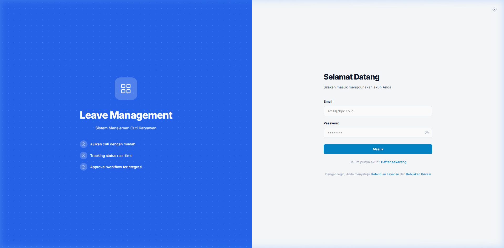
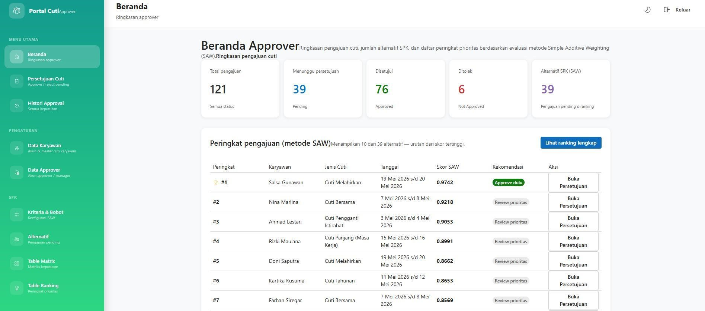
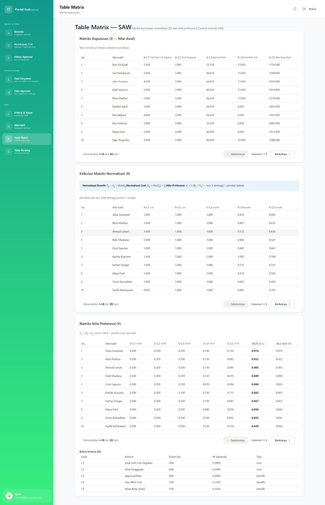

# Leave Management System with SPK (Sistem Pendukung Keputusan)

Sistem Informasi Manajemen Cuti Karyawan yang modern dan responsif, terintegrasi dengan Sistem Pendukung Keputusan (SPK) menggunakan metode SAW (Simple Additive Weighting).

## 🌟 Fitur Utama
- **Dashboard Karyawan**: Pengajuan cuti, tracking status real-time, dan histori cuti.
- **Dashboard Approver**: Manajemen persetujuan cuti, kelola data karyawan, dan data approver.
- **SPK SAW Terintegrasi**: Sistem akan memberikan rekomendasi otomatis untuk persetujuan cuti berdasarkan kriteria objektif (Masa Kerja, Sisa Cuti, dll).
- **Matrix & Ranking**: Visualisasi proses perhitungan SPK secara transparan dari Matriks Keputusan hingga nilai Ranking akhir.
- **Sistem Autentikasi**: Fitur Login dan Pendaftaran akun yang aman dengan perlindungan visibilitas password.
- **Desain Modern**: Antarmuka pengguna bergaya minimalis dan elegan, mendukung mode Gelap (Dark Mode) dan Terang (Light Mode).

## 🚀 Teknologi yang Digunakan
- **Frontend**: React.js, Vite, React Router DOM, Custom CSS
- **Backend**: Node.js, Express.js
- **Database**: PostgreSQL
- **Koneksi**: RESTful API menggunakan `fetch`

## 📸 Screenshots

### Halaman Login & Pendaftaran
Tampilan minimalis dengan fitur *toggle* mata untuk visibilitas password.

### Dashboard Approver (Beranda)
Tampilan data pengajuan cuti beserta ringkasan status.

### SPK Matrix & Ranking
Tampilan matriks penilaian cuti dan tabel ranking yang tersusun rapi dengan rata tengah presisi untuk seluruh elemen data angka.

---
*Dibuat untuk mempermudah manajemen cuti perusahaan dan membantu pengambilan keputusan persetujuan secara objektif.*
